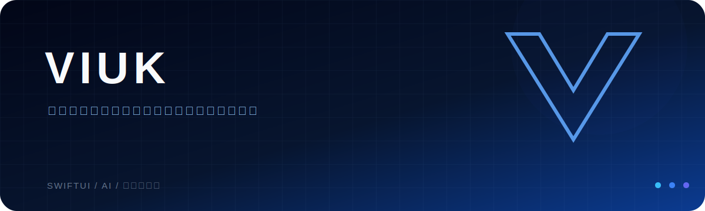

  

<h1 align="center">まだないものを創れ。 追うなら、追い越せ。</h1>

## BUILDS / 01

### VIUK ONE

物語、知性、人とのつながりを再設計するiOSプロジェクト。  
`SWIFT`　`SWIFTUI`　`ON-DEVICE AI`

**[プロジェクトを見る →](https://github.com/VIUK-XV/VIUK-one)**

### LOVES

画面を二人の会話に変える、共有型の質問カード体験。  
`WEB`　`INTERACTION`　`TWO-PLAYER`

**[プロジェクトを見る →](https://github.com/VIUK-XV/loves-web)**

 

## AI LAB / 02

モデル開発、ローカルAI、オープンな機械学習の実験。  
`PYTORCH`　`TRANSFORMERS`　`LOCAL AI`

**[Hugging Faceを見る →](https://huggingface.co/Shirokuma-VIUK)**

 

---

  <strong>VIUK</strong> 
  CREATE WHAT COMES NEXT.

